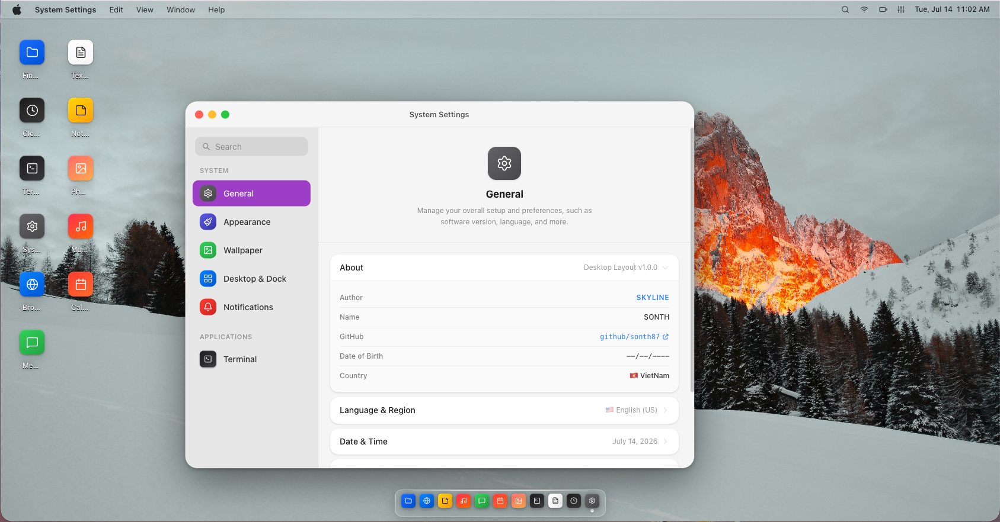

# Device Layout

**Device Layout** is a browser-based desktop OS simulator designed to replicate the look and feel of popular operating systems (macOS, Windows 11, iPadOS, iOS, Android). 

The core goal of this project is to provide a multi-window simulation environment where any added feature or module can be defined as an individual, isolated app running inside its own window. This architecture makes it highly suitable for deploying multi-functional applications (such as composite web dashboards or mock workspaces), or simply for fun! :D



Built with Next.js 16, React 19, TypeScript, Tailwind CSS v4, Zustand, and Motion.

**Live preview:** [device-layout.vercel.app](https://device-layout.vercel.app) · **Source:** [github.com/sonth87/device-layout](https://github.com/sonth87/device-layout)

---

## Documentation

- [Architecture](docs/architecture.md) — folder structure, store slices, data flow
- [Agent Guidelines](docs/agent-guidelines.md) — conventions and rules for AI agents
- [Theme System](docs/content/themes.md) — OS themes, config, adding themes
- [Window Management](docs/content/windows.md) — drag, resize, snap, fullscreen
- [App System](docs/content/apps.md) — AppConfig, adding apps, iframe/MDX apps
- [Liquid Glass](docs/content/liquid-glass.md) — glass effect layers and implementation
- [URL State](docs/content/url-state.md) — window state encoding and hydration

---

## Features

**Multi-theme OS simulation**

Switch between five OS themes at runtime. Each theme changes the entire chrome — dock, taskbar, menubar, window decorations, and layout behavior.

| Theme | Chrome | Window style |
|-------|--------|--------------|
| macOS 26 | Menubar top + floating dock | Traffic lights, drag-to-snap, Liquid Glass |
| Windows 11 | Taskbar bottom | Win11 controls, snap assist (blue) |
| iPad OS 26 | Menubar top + dock | Floating windows, Liquid Glass |
| iPhone OS 26 | Bottom nav bar | Fullscreen apps |
| Android | Bottom nav bar | Fullscreen apps |

**Window management**

- Drag windows by title bar. Edge-resistance prevents accidentally throwing windows off screen.
- Resize from all 8 edges and corners.
- Snap to top = fullscreen (macOS: below menubar to bottom edge; Windows: respects taskbar).
- Snap to left/right = half-screen, corners = quarter-screen. Overlay preview shown while dragging.
- Fullscreen auto-hides the dock on macOS. Move mouse to the bottom edge to reveal it.
- Minimize, restore, maximize/unmaximize with spring animation.
- Drag a maximized window to unmaximize and grab it proportionally under the cursor.

**URL state**

Every open window — its position, size, maximized state, and the previous position before maximize — is encoded in the URL as `?w=` params. Reload the page and all windows reopen in the same state.

Wire format: `appId:x,y,width,height[:flags[:prevX,prevY,prevW,prevH]]`

**App system**

Apps are declared entirely in `src/config/apps.config.ts` as JSON config objects. No code changes needed to add a new app — just register it and it appears in the dock and desktop.

Each app can be: a React component, an embedded iframe, or an MDX page. Apps are code-split and loaded lazily when their window opens.

**Liquid Glass**

Dock, menubar, tooltips, and panel overlays use a composited glass effect built from CSS backdrop-filter, SVG displacement, WebGL2 shimmer, and a specular gradient highlight. Toggleable per-session in System Settings.

**Additional**

- Dark / light / system color scheme
- Dock icon magnification on hover (macOS)
- Wallpaper picker via desktop right-click context menu
- Notification banners
- PWA-ready with offline support via service worker
- URL-encoded window state — reload and all windows reopen at the same position

---

## Stack

```
next@16              react@19             typescript@5
tailwindcss@4        tailwind-merge       clsx
motion               zustand@5 + immer    @tanstack/react-query@5
@radix-ui/*          lucide-react         nanoid
```

---

## Getting Started

```bash
npm install
npm run dev     # http://localhost:3000/desktop
npm run build
npm run lint
```

## Adding a New App

See **[docs/content/apps.md](docs/content/apps.md)** for the full guide — AppConfig reference, layout patterns (sidebar, split-view, responsive grid), menu bar declarations, context menus, and settings panels.
