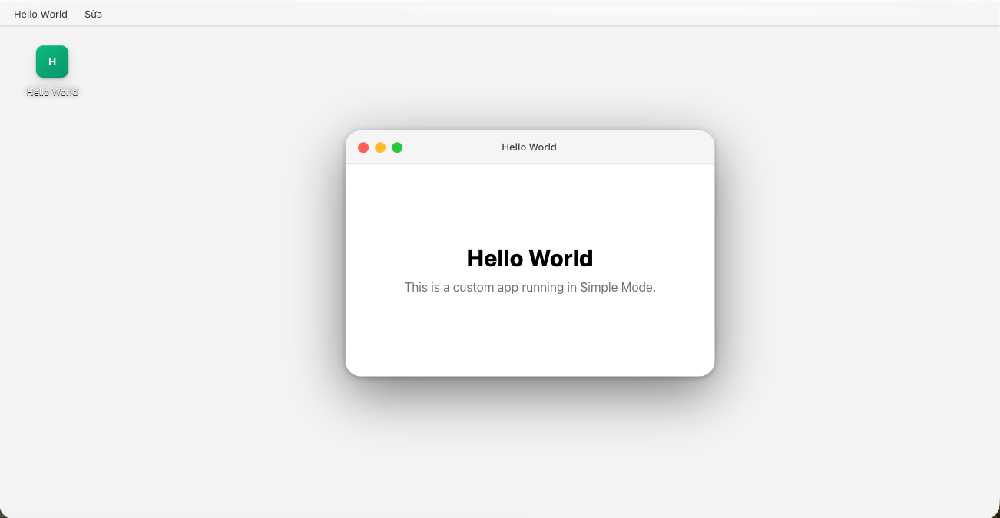
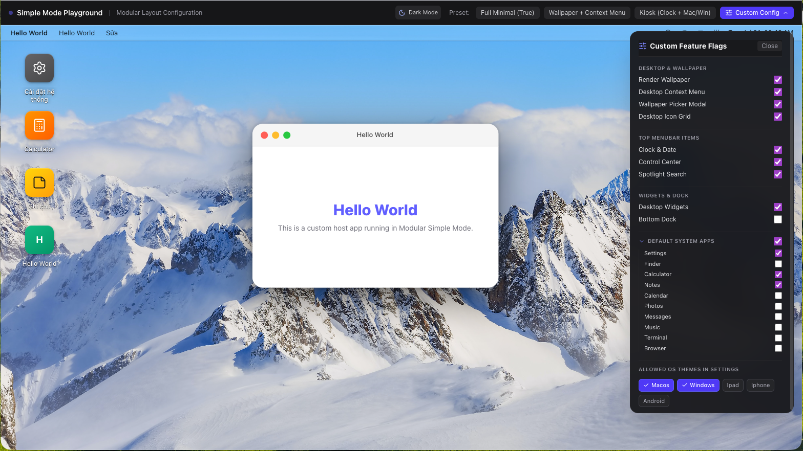

# Simple Mode Integration & Configuration Guide

**Simple Mode** (`isSimpleMode`) provides a clean, modular desktop simulator layout for embedded environments, web app wrappers, or kiosk displays where you want to customize or restrict standard desktop features.

## Overview

Simple Mode supports two usage modes:
1. **Full Minimal Mode (`isSimpleMode={true}`)**: 100% backward compatible minimal mode with solid color wallpaper, no Dock, no desktop widgets, no default system apps, and a minimal menu bar.
2. **Modular Granular Mode (`isSimpleMode={SimpleModeFeatures}`)**: A fine-grained feature flag configuration object allowing host applications to selectively enable or disable individual desktop components.

### Full Minimal Mode (`isSimpleMode={true}`)


### Modular Simple Mode with Custom Config


---

## SimpleModeFeatures API Reference

Host applications can pass a detailed `SimpleModeFeatures` object to `isSimpleMode`:

```typescript
export type SimpleModeProp = boolean | SimpleModeFeatures;

export interface SimpleModeFeatures {
  /** 1. Render dynamic image/video wallpapers instead of solid color (Default: false) */
  wallpaper?: boolean;

  /** 2. Enable desktop right-click context menu (Default: false) */
  contextMenu?: boolean;

  /** 3. Enable standalone wallpaper picker modal when Settings app is omitted (Default: false) */
  wallpaperPicker?: boolean;

  /** 4. Enable desktop icon grid (Default: true) */
  iconGrid?: boolean;

  /** 5. Top MenuBar sub-feature controls */
  menuBar?: {
    clock?: boolean;          // Show clock & date in top-right (Default: false)
    controlCenter?: boolean;  // Show Control Center toggle (Default: false)
    spotlight?: boolean;      // Show Spotlight search button (Default: false)
    appleMenu?: boolean;      // Show Apple logo menu (Default: false)
    appNameMenu?: boolean;    // Show active app name menu (Default: true)
    appSwitcher?: boolean;    // Show app switcher (Default: false)
  };

  /** 6. Desktop Widgets (Default: false) */
  widgets?: boolean | {
    allowGalleryEdit?: boolean;
  };

  /** 7. Show bottom Dock bar (Default: false) */
  dock?: boolean;

  /** 8. System Default Apps to register (Default: false)
   *  - false: Register 0 default apps
   *  - true: Register all default system apps
   *  - string[]: Register only specified apps, e.g. ['settings', 'calculator', 'notes']
   */
  defaultApps?: boolean | string[];

  /** 9. Restrict allowed OS Themes in Settings Appearance panel
   *  e.g. ['macos', 'windows'] (Default: ['macos'])
   *  If array length <= 1, the OS Theme selector in Settings is automatically hidden.
   */
  allowedOSThemes?: OSTheme[];
}
```

---

## Code Examples

### 1. Full Minimal Mode (Default Kiosk / Embedded)
Omits all default apps, hides dock, wallpaper images, and widgets:

```tsx
import { DeviceLayout } from '@sonth87/device-layout';
import '@sonth87/device-layout/style.css';

export function MinimalDesktop() {
  return (
    <DeviceLayout
      isSimpleMode={true}
      apps={[myCustomApp]}
    />
  );
}
```

### 2. Wallpaper & Desktop Context Menu Preset
Enables wallpapers, desktop right-click menu, and standalone floating wallpaper picker modal without registering full system apps:

```tsx
import { DeviceLayout } from '@sonth87/device-layout';

export function WallpaperDesktop() {
  return (
    <DeviceLayout
      isSimpleMode={{
        wallpaper: true,
        contextMenu: true,
        wallpaperPicker: true,
        iconGrid: true,
      }}
      apps={[myCustomApp]}
    />
  );
}
```

### 3. Kiosk Display (Clock + Mac/Win OS Theme Switching)
Registers only specific system apps (`settings`, `calculator`), enables clock & control center in top menu bar, and restricts theme switching to macOS & Windows 11:

```tsx
import { DeviceLayout } from '@sonth87/device-layout';

export function KioskDesktop() {
  return (
    <DeviceLayout
      isSimpleMode={{
        wallpaper: true,
        contextMenu: true,
        wallpaperPicker: true,
        iconGrid: true,
        menuBar: {
          clock: true,
          controlCenter: true,
          spotlight: true,
        },
        defaultApps: ['settings', 'calculator'],
        allowedOSThemes: ['macos', 'windows'],
      }}
      apps={[myCustomApp]}
    />
  );
}
```

---

## Interactive Playground & Testing

A live interactive playground is available at `/simple`.

Run the development sandbox:
```bash
npm run dev:simple
```

This starts the dev server and opens `http://localhost:3000/simple`.

In the `/simple` playground header:
- **Light / Dark Mode Toggle**: One-click theme switcher to verify component rendering in both light and dark mode.
- **Preset Buttons**: Quick switch between *Full Minimal*, *Wallpaper + Context Menu*, *Kiosk*, and *Custom Config*.
- **Custom Config Drawer**: Real-time interactive panel with checkboxes for all feature flags and a collapsible **Default System Apps** selector.
